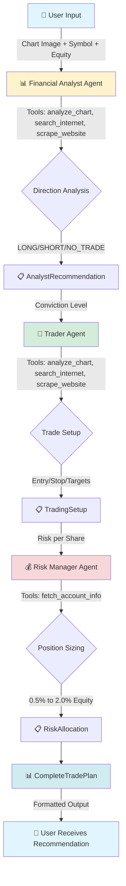

# AI Trading Advisor

## Overview

AI Trading Advisor is a multi-agent AI system that analyzes trading chart screenshots and provides comprehensive trade recommendations including technical analysis, precise trade setups, and risk management guidance. Built with **CrewAI** and **Gradio**, using Google's **Gemini 2.0 Flash** model, it combines visual chart analysis, internet research, and structured decision-making to deliver actionable trading insights.

## Key Features

- 🤖 **Multi-Agent Workflow**: Three specialized AI agents work sequentially:
  - **Financial Analyst** - Analyzes charts visually, researches market context, determines directional bias: **LONG**, **SHORT** or **NO_TRADE**)
  - **Trader** - Creates precise trading setups with entry, stop loss, and take profit levels based on the Financial Analyst's and own analysis.
  - **Risk Manager** - Calculates position sizing and risk allocation (**0.5% to 2.0%** of equity), depending on the conviction level.

- 📊 **Visual Chart Analysis**: AI-powered image recognition using **Gemini 2.0 Flash** model to identify technical patterns, trends, support/resistance, and market structure directly from chart screenshots

- 🔍 **Real-Time Market Research**: Agents can search the internet for news, fundamentals and macroeconomic data, using **Serper API**, to enrich analysis.

- 🌐 **Web Scraping**: Agents can deep-dive into specific articles and reports to gather detailed market information.

- 💰 **Risk Management**: Automated position sizing with strict risk limits tied account equity and trade conviction.

- 🖥️ **User-Friendly Interface**: Clean **Gradio** web UI for uploading charts, specifying symbols, and receiving formatted recommendations.

- 📋 **Structured Output**: **Pydantic** models ensure type-safe data flow between agents with validation and computed properties.

## How It Works



**Workflow Process:**
1. **Input Stage**: User provides chart screenshot, trading symbol, account equity and optional custom prompt.
2. **Financial Analyst**: Analyzes chart visually using AI vision, researches market context and determines directional bias (LONG/SHORT/NO_TRADE) with conviction level.
3. **Trader**: Creates precise trade setup with entry price, stop loss, and take profit targets based on chart structure and analyst recommendation.
4. **Risk Manager**: Calculates position size and risk allocation (0.5% to 2.0% of equity) based on trade conviction and setup quality.
5. **Output Stage**: Returns structured `CompleteTradePlan` with all recommendations formatted for user review.

## �💻 System Requirements

The installation process and app usage have been tested on **Windows 11** with **Anaconda3 2024.10 (Python 3.12.7 64-bit)** distribution. Slight modifications may be required to make it run on other systems and/or Python distributions.

## ⚙️ Installation Guide 

### 1️⃣ Clone the Repository
```
git clone https://github.com/coder907/ai-trading-advisor ai-trading-advisor
cd ai-trading-advisor
```

### 2️⃣ Set Up and Activate Virtual Environment 
```
conda create --name ai-trading-advisor-env python=3.12.7
conda activate ai-trading-advisor-env
```

### 3️⃣ Install Dependencies  
```
pip install -r requirements.txt
```

### 4️⃣ Set Up API Keys
AI Trading Advisor uses **Gemini 2.0 Flash** model and requires **Google API Key** and **Serper API Key** for processing. Create `.env` file in the `ai-trading-advisor` folder and provide your API keys in the following format:
```
GOOGLE_API_KEY = <YOUR_GOOGLE_API_KEY>
SERPER_API_KEY = <YOUR_SERPER_API_KEY>
```

Where to get API keys:
- **Google API Key**: Get from [Google AI Studio](https://makersuite.google.com/app/apikey)
- **Serper API Key**: Get from [Serper.dev](https://serper.dev/)

### 5️⃣ Run the Application
```
python app.py
```
AI Trading Advisor will be accessible at `http://localhost:7860`.

## 🖥️ Usage Guide  

1. **Upload Chart Screenshot**:
   - Click the **Chart Screenshot** area and select your trading chart image.
   - Supported formats: **.png**, **.jpg**, **.jpeg**

2. **Enter Trading Details**:
   - **Trading Symbol**: Enter the ticker symbol (e.g., ES, AAPL, BTCUSD, EURUSD).
   - **Account Equity**: Specify your trading account equity in dollars (e.g. $100000).
   - **User Prompt** (Optional): Add specific analysis requirements, context or other custom instructions.

3. **Analyze Chart**:
   - Click the **🚀 Analyze Chart** button.
   - Wait for the multi-agent workflow to complete (typically 30 to 90 seconds).

4. **Review Recommendations**:
   - **Financial Analyst Recommendation**: Direction, conviction and analysis details.
   - **Trading Setup**: Entry price, stop loss and take profit targets with justification.
   - **Risk Management**: Position size, risk amount and allocation reasoning.
   - **Executive Summary**: Quick overview of the trade plan.

5. **Example Symbols to Try**:
   - **Indices**: ES, NQ, YM, RTY
   - **Stocks**: AAPL, GOOGL, MSFT, NVDA, TSLA
   - **Crypto**: BTCUSD, ETHUSD, SOLUSD
   - **Forex**: EURUSD, GBPUSD, USDJPY
   - **Metals**: XAUUSD, XAGUSD, PL
   - **Commodities**: KC, CC, OJ

## 📁 File Structure

```
ai-trading-advisor/
├── .env                                         # API keys (create this file)
├── .gitignore                                   # Git ignore rules
├── app.py                                       # Main Gradio application and UI
├── crew.py                                      # CrewAI orchestration and workflow logic
├── LICENSE                                      # Project license
├── README.md                                    # This file
├── requirements.txt                             # Python dependencies
│                 
├── config/                                      # Agent and task configurations
│   ├── agents/
│   │   ├── financial_analyst_agent.yaml
│   │   ├── risk_manager_agent.yaml
│   │   └── trader_agent.yaml
│   └── tasks/
│       ├── financial_analyst_task.yaml
│       ├── risk_manager_task.yaml
│       └── trader_task.yaml
│
├── models/                                      # Pydantic data models
│   ├── __init__.py                  
│   ├── analyst.py                               # AnalystRecommendation model
│   ├── base.py                                  # TechnicalFactors, PriceLevel models
│   ├── enums.py                                 # TradeDirection, ConvictionLevel enums
│   ├── risk_manager.py                          # RiskAllocation model
│   ├── trade_plan.py                            # CompleteTradePlan model
│   └── trader.py                                # TradingSetup model
│                  
└── tools/                                       # Custom tools
    ├── __init__.py                  
    ├── account_tool.py                          # Account equity fetching
    ├── chart_analysis_tool.py                   # AI visual chart analysis
    ├── scrape_tool.py                           # Web scraping via Serper
    └── search_tool.py                           # Internet search via Serper
```

## 🛠️ Technology
- **CrewAI**: Multi-agent orchestration framework
- **Gradio**: Web UI framework
- **Google Gemini 2.0 Flash**: LLM for reasoning and Gemini Vision for chart analysis
- **LiteLLM**: LLM provider abstraction
- **Serper API**: Internet search and web scraping
- **Pydantic**: Data validation and structured outputs
- **Python 3.12**: Core programming language and platform

## ⚠️ Disclaimer

**This is an AI-powered analysis tool for educational purposes only. Not financial advice.**
- Always conduct your own research and due diligence.
- Never risk more than you can afford to lose.
- Consult licensed financial professionals before making trading decisions.
- Past performance does not guarantee future results.
- AI recommendations can be wrong and should be independently verified.
- Trading involves substantial risk of loss.

## 📝 License

This project is licensed under the MIT License - see the [LICENSE](LICENSE) file for details.

## 📧 Support

For questions, issues, or feedback, please open an issue on GitHub or contact the maintainer.

---

**Built with ❤️ using CrewAI, Gradio and Google Gemini.**